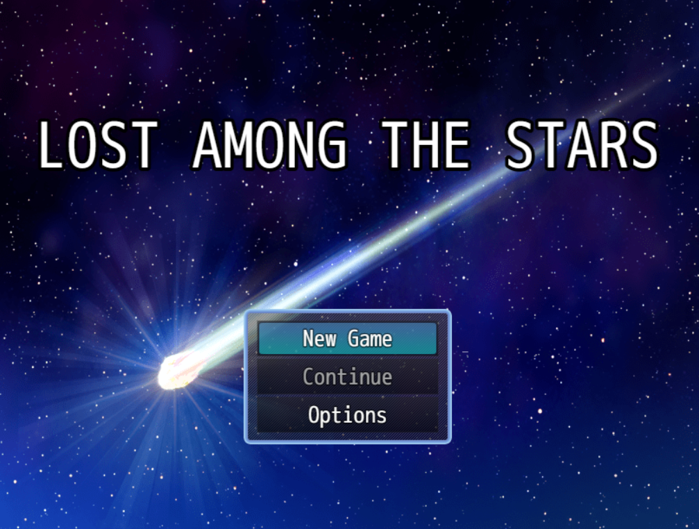
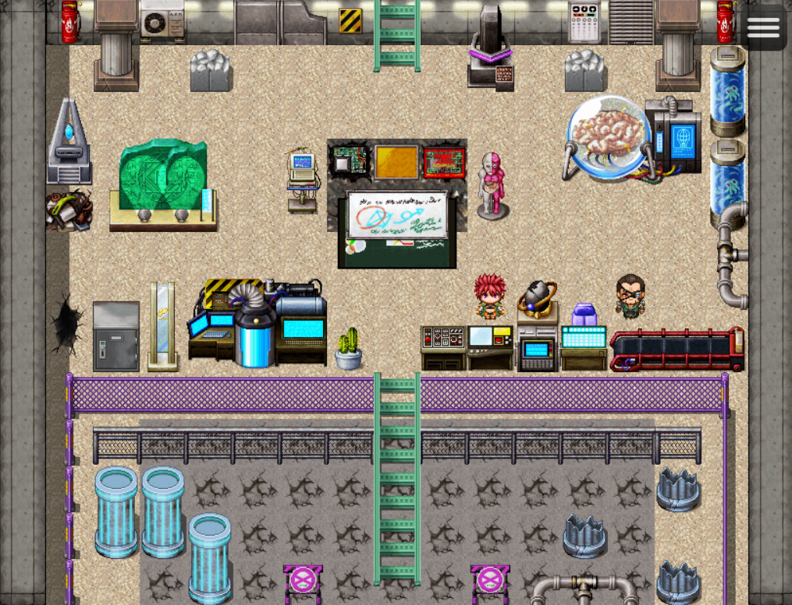
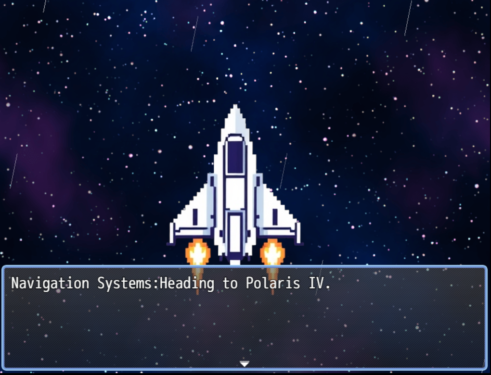
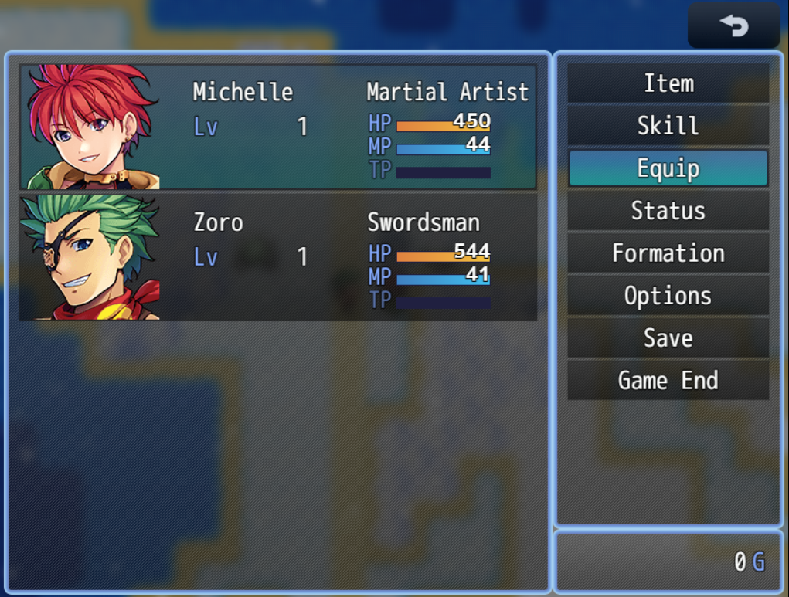
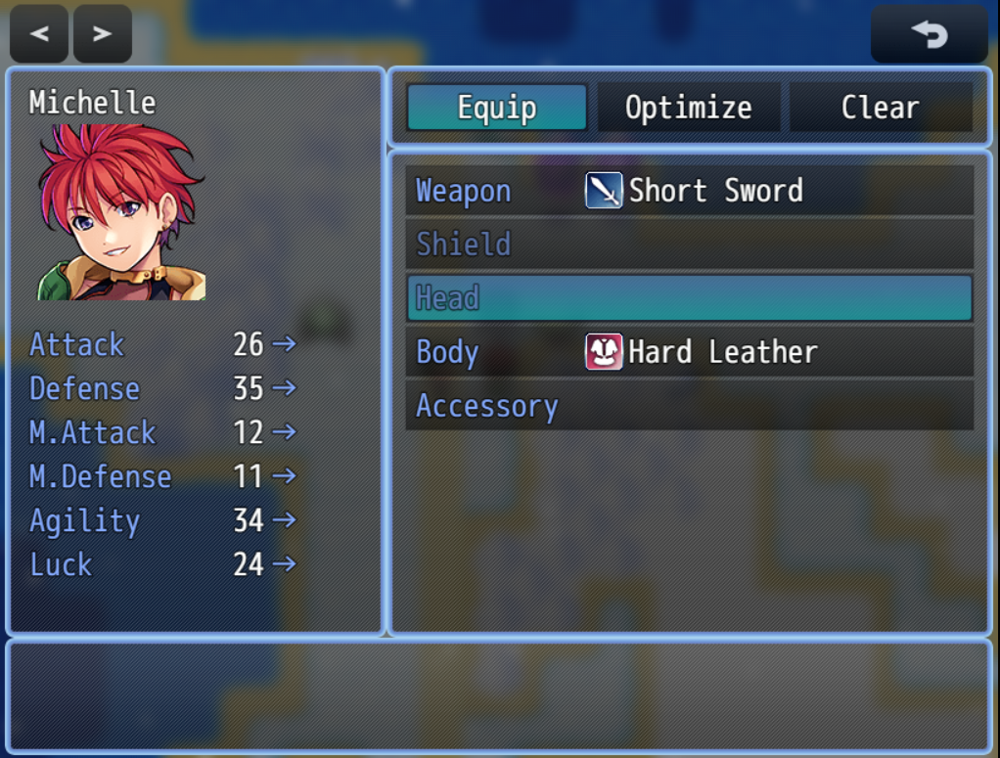
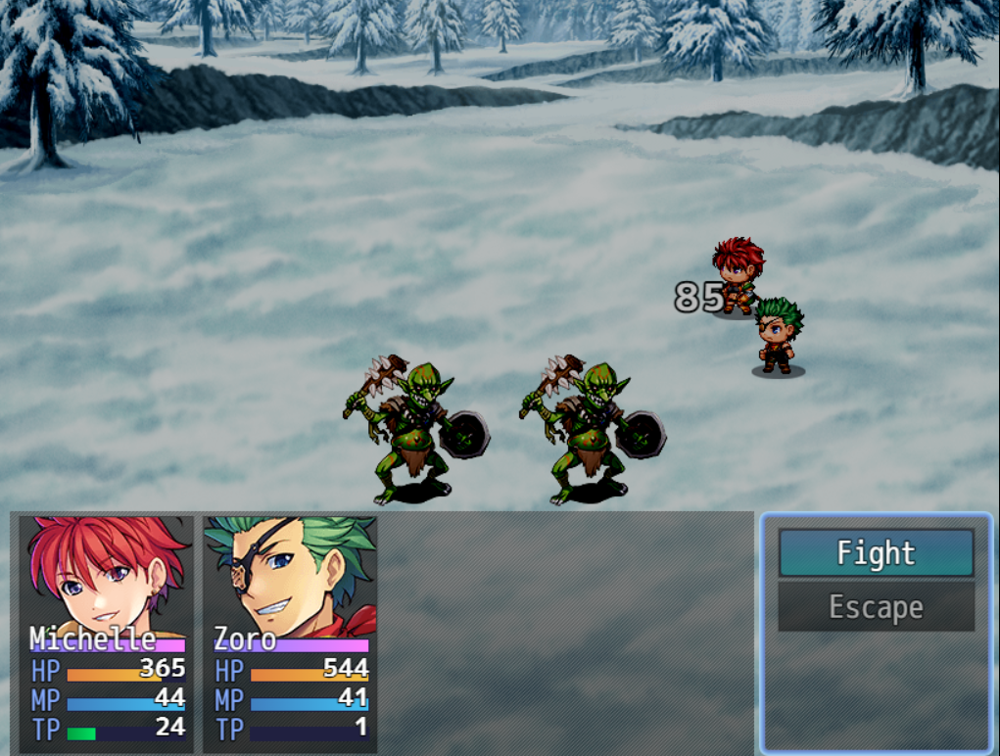
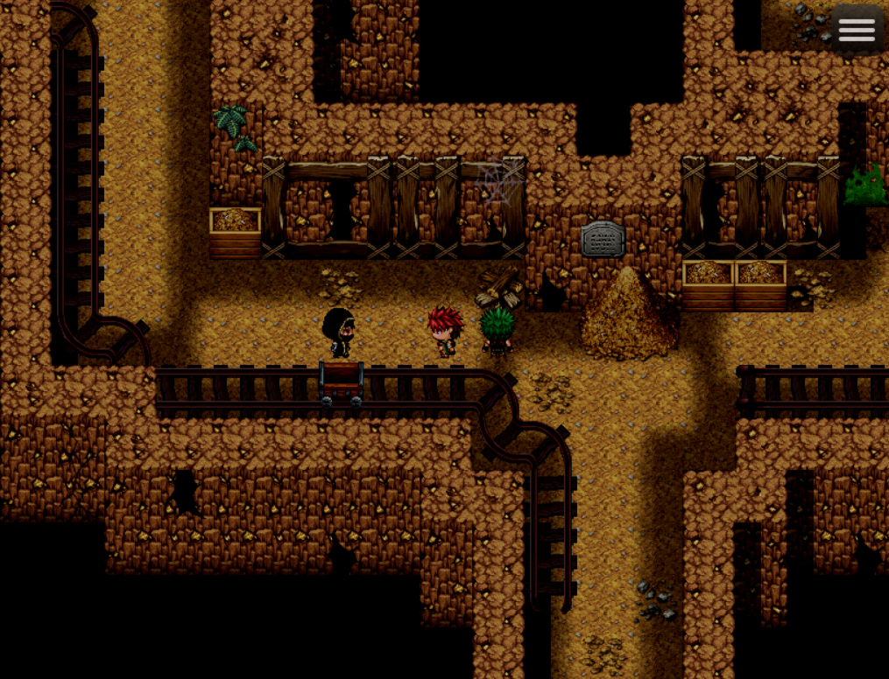

# 🌌 **Lost Among the Stars**

### *A Sci-Fi RPG Adventure Across Unknown Worlds*

<p align="center">
  
  
  
  
  
  
</p>

---

## 🎮 **Play the Game**

🟢 **Live Web Build:** [https://lostinthestars.netlify.app/](https://lostinthestars.netlify.app/)

---

## 🏆 **About the Project**

**Lost Among the Stars** was created during the **3-Day Game Development Jam** hosted by
🎮 **Game Developers Association of CRCE (GDAxCRCE)**
🏆 **We won 1st Prize for this project!**

Built using **RPG Maker MZ**, this game is an **atmospheric sci-fi exploration RPG** combining:

* Cosmic storytelling
* Alien worlds & environments
* Pixel-art battles
* RPG mechanics (inventory, stats, skills)
* Environmental lore
* Space-themed progression

---

## 📘 **Short Description**

**Lost Among the Stars** is a sci-fi RPG where you control a stranded astronaut navigating unknown star systems, discovering alien technology, battling hostile creatures, and uncovering the mysteries behind an ancient interstellar civilization.

---

# 🪐 **Storyline & Lore**

## ⭐ **Premise**

During a hyperspace expedition to **Polaris IV**, your ship suffers a catastrophic failure. You fall out of warp and crash-land into an uncharted star system—isolated, damaged, and alone.


## ⭐ **The World**

You soon discover:

* **Derelict labs**
* **Abandoned asteroid mines**
* **Hostile alien creatures**
* **Encrypted logs**
* **Signs of an ancient alien race — the Elythari**

Their ruins whisper fragments of a lost civilization… and possibly the way home.

## ⭐ **Your Mission**

✔ Restore your ship
✔ Survive alien encounters
✔ Solve environmental puzzles
✔ Decode inscriptions
✔ Uncover the truth
✔ Escape the star system… or be lost forever

---

# 🎮 **Screenshots (Previews)**

<details>
<summary>📸 Click to View Game Screenshots</summary>
<br>

### ⭐ Title Screen



### ⭐ Alien Research Lab



### ⭐ Spaceship – Navigation Scene



### ⭐ Character Menu UI (Michelle & Zoro)



### ⭐ Equipment & Stats Screen



### ⭐ Battle Scene – Frozen Planet



### ⭐ Abandoned Mine (NPC Encounter)



</details>

---

# 🧭 **Gameplay Features**

| Feature                  | Description                                      |
| ------------------------ | ------------------------------------------------ |
| 🚀 **World Exploration** | Visit alien labs, mines, snow planets & stations |
| ⚔️ **Turn-Based Combat** | Strategic battles against alien creatures        |
| 🧩 **Puzzle Mechanics**  | Switches, locks, logs & environmental triggers   |
| 🛠️ **Equipment System** | Weapons, armor, accessories                      |
| 📜 **Lore Collection**   | Scattered logs build the story                   |
| 🧬 **Alien Ruins**       | Explore Elythari civilization remains            |

---

# 🛠️ **How We Built It – Development Process**

## **1️⃣ Story & World Building**

* Sci-fi theme brainstorming
* Polaris IV mission concept
* Lore design for Elythari civilization

## **2️⃣ Map & Level Design**

* Alien lab
* Snow battlefield
* Mines & underground tunnels
* Spaceship interiors
* Custom tile combinations

## **3️⃣ Events & Logic**

* NPC interactions
* AI dialogue system
* Battle triggers
* Warp transitions
* Area locks/unlocks

## **4️⃣ RPG Systems**

* Stat balancing
* Inventory & equipment
* Party members
* Skill trees

## **5️⃣ Testing**

* Gameplay loop validation
* Enemy balancing
* UI checks
* Mobile browser testing

## **6️⃣ Deployment**

* Exported web build
* Deployed on **Netlify**
* Optimized for performance

---

# 📁 **Project Structure**

```
📁 img            → Sprites, tilesets, UI  
📁 data           → RPG Maker data  
📁 js             → Engine scripts  
📁 audio          → Music & sound effects  
📁 movies         → Cutscenes  
📁 save           → Save files  
📁 assets         → Screenshots for README  
📄 index.html     → Game web entry  
📄 project.rpgproject → Main RPG Maker project  
```
---
# 🌌 **Team Members**

| Member             | Contribution                                                                                                                        |
| ------------------ | ----------------------------------------------------------------------------------------------------------------------------------- |
| **Deepkumar Das**  | Created the **spaceship level**, came up with the **initial game idea**, and finalized the **game engine selection (RPG Maker MZ)** |
| **Pranav Shirke**  | Designed and developed the **desert level**, including map layout and enemy encounters                                              |
| **Harshali Singh** | Built the **jungle level**, focusing on environmental storytelling and exploration elements                                         |
| **Gideon Mire**    | Developed the **snow level** and programmed the **final boss fight inside the volcano**                                             |

---

# 🙏 **Acknowledgements**

* **GDA–CRCE** for hosting the 3-Day Game Jam
* **Team Members & Playtesters**
* Sci-fi inspiration from games, film, and literature

